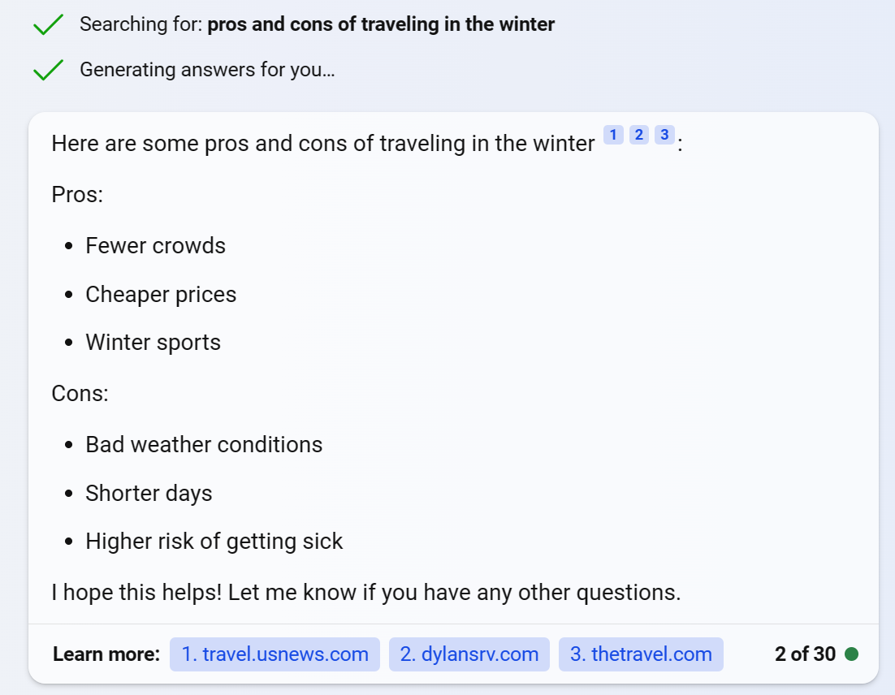

# Copilot

## Explore a IA generativa com o Microsoft Copilot

Neste exercício você explorará a IA generativa com o Microsoft Copilot.

## Faça login no Microsoft Copilot

1. Abra [o Microsoft Copilot](https://copilot.microsoft.com/) em https://copilot.microsoft.come entre com sua conta pessoal da Microsoft.
1. O Microsoft Copilot usa IA generativa para aprimorar os resultados de pesquisa do Bing. O que isto significa é que, diferentemente da pesquisa apenas, que retorna conteúdo existente, o Microsoft Copilot pode reunir novas respostas com base na modelagem de linguagem natural e nas informações da web.
1. Na parte inferior da tela, você verá uma janela **Pergunte-me qualquer coisa** . À medida que você insere prompts na janela, o Copilot usa todo o thread da conversa para retornar respostas. Por exemplo, vamos tentar fazer uma série de perguntas sobre viagens.

## Use prompts para gerar respostas

1. Digite um prompt: What are 3 pros and cons of traveling in the winter?. Você verá *Searching for:…* e *Generating…* aparecer antes da resposta. O modelo usa as respostas pesquisadas como informação de base para gerar respostas originais. Observe que o final da resposta contém links para suas fontes.

**Nota** : Se você não vir uma mensagem *\*Generating…* ou uma resposta de lista com marcadores, você ainda não conseguiu ver o Copilot em ação. Você precisa retornar ao menu de login e conectar a conta atual que está usando com uma conta pessoal.

1. Digite um prompt: Find me 3 more pros. O que você quer dizer com esta mensagem é que gostaria de ver mais três motivos positivos para viajar no inverno que ainda não foram listados. Observe que, com esse prompt, você está solicitando ao Copilot que faça duas coisas que a pesquisa por si só não faz: usar a resposta do chat anterior para excluir o que é retornado na nova resposta e usar o tópico do chat anterior sem declará-lo explicitamente.
1. Digite um prompt: Where are 3 places I can go to find fewer crowds?.

**Observação** : observe que, embora o Copilot seja capaz de fornecer uma resposta relacionada, ele pode eliminar “memórias” anteriores do tópico da conversa à medida que continua. Como resultado, as respostas que você obtém podem não estar diretamente relacionadas às viagens no inverno. Isso tem muito a ver com limitações de entrada de token. Quando o chat “lembra” partes anteriores de uma conversa, é porque economizou uma certa quantidade de tokens da conversa. À medida que novos tokens são introduzidos por meio de suas novas solicitações e respostas, o chat irá liberar os tokens mais antigos.

1. O botão **Novo tópico** próximo à janela de bate-papo é útil. Clicar nele limpa o tópico da conversa anterior para que as respostas do novo tópico não sejam baseadas no tópico anterior. Use o ícone **Novo tópico** próximo à janela de bate-papo para limpar seu histórico de mensagens.

## Experimente a geração de imagens

1. Agora vamos ver um exemplo de geração de imagens. Digite um prompt: Create an image of an elephant eating a hamburger. Observe que uma mensagem *que tentarei criar que…* aparece antes que o Copilot retorne uma resposta.

   

**Nota** : Suas imagens podem não ser idênticas às mostradas aqui.

1. Na resposta, há um texto na parte inferior que diz “Powered by DALL-E”. DALL-E é um modelo de linguagem grande que gera imagens a partir de entrada de linguagem natural.

## Experimente a geração de código

1. Agora vamos ver um exemplo de geração e tradução de código. Digite um prompt: Use Python to create a list.
1. Digite no prompt: Translate that into C#. Observe como você não precisou especificar o que é “aquilo”, como o Copilot sabe para se referir ao histórico de conversas.

## Tarefa bônus

1. Digite um prompt: What are 3 examples of generative AI helping people?. Você pode usar isso como uma forma de debater suas próprias ideias de copiloto!

## Ler texto no Vision Studio

Neste exercício, você usará o serviço Azure AI para explorar os recursos de reconhecimento óptico de caracteres do Azure AI Vision. Você usará o Vision Studio para experimentar a extração de texto de imagens, sem precisar escrever nenhum código.

Um desafio comum da visão computacional é detectar e interpretar texto incorporado em uma imagem. Isso é conhecido como reconhecimento óptico de caracteres (OCR). Neste exercício você usará um recurso de serviços de IA do Azure, que inclui serviços do Azure AI Vision. Em seguida, você usará o Vision Studio para testar o OCR com diferentes tipos de imagens.

Crie um recurso *de serviços de IA do Azure*

Você pode usar os recursos de OCR do Azure AI Vision com um recurso multisserviço **de serviços de IA do Azure** . Se ainda não o fez, crie um recurso **de serviços de IA do Azure** na sua assinatura do Azure.

1. Em outra guia do navegador, abra o **portal do Azure** em [https://portal.azure.com](https://portal.azure.com/?azure-portal=true) , entrando com a conta da Microsoft associada à sua assinatura do Azure.
1. Clique no botão **＋Criar um recurso** e pesquise os *serviços de IA do Azure* . Selecione **criar** um plano **de serviços de IA do Azure** . Você será levado a uma página para criar um recurso de serviços de IA do Azure. Configure-o com as seguintes configurações:
   1. **Assinatura** : *sua assinatura do Azure* .
   1. **Grupo de recursos** : *selecione ou crie um grupo de recursos com um nome exclusivo* .
   1. **Região** : Leste dos EUA.
   1. **Nome** : *Insira um nome exclusivo* .
   1. **Nível de preços** : *Padrão S0.*
   1. **Ao marcar esta caixa, confirmo que li e compreendi todos os termos abaixo** : *Selecionado* .
1. Selecione **Revisar + criar** e depois **Criar** e aguarde a conclusão da implantação.

Conecte seu recurso de serviço de IA do Azure ao Vision Studio

Em seguida, conecte o recurso de serviços de IA do Azure provisionado acima ao Vision Studio.

1. Em outra guia do navegador, navegue até **Vision Studio** em [https://portal.vision.cognitive.azure.com](https://portal.vision.cognitive.azure.com/?azure-portal=true) .
1. Entre com sua conta e certifique-se de usar o mesmo diretório onde você criou seu recurso de serviços de IA do Azure.
1. Na página inicial do Vision Studio, selecione **Visualizar todos os recursos** no título **Introdução ao Vision** .

   

1. Na página **Selecione um recurso para trabalhar** , passe o cursor do mouse sobre o recurso que você criou acima na lista e marque a caixa à esquerda do nome do recurso e selecione **Selecionar como recurso padrão** .

**Nota** : Se o seu recurso não estiver listado, pode ser necessário **atualizar** a página.

1. Feche a página de configurações selecionando o “x” no canto superior direito da tela.

Extraia texto de imagens no Vision Studio

1. Num navegador web, navegue até **Vision Studio** em [https://portal.vision.cognitive.azure.com](https://portal.vision.cognitive.azure.com/?azure-portal=true) .
1. Na página **inicial Introdução ao Vision** , selecione **Reconhecimento óptico de caracteres** e, em seguida, o bloco **Extrair texto de imagens** .
1. No subtítulo **Experimente** , reconheça a política de uso de recursos lendo e marcando a caixa.
1. Selecione [**https://aka.ms/mslearn-ocr-images**](https://aka.ms/mslearn-ocr-images) para baixar **ocr-images.zip** . Em seguida, abra a pasta.
1. No portal, selecione **Procurar um arquivo** e navegue até a pasta em seu computador onde você baixou **ocr-images.zip** . Selecione **advert.jpg** e selecione **Abrir** .
1. Agora revise o que é retornado:
   1. Nos **atributos detectados** , qualquer texto encontrado na imagem é organizado em uma estrutura hierárquica de regiões, linhas e palavras.
   1. Na imagem, a localização do texto é indicada por uma caixa delimitadora, conforme mostrado aqui:

   
 
1. Agora você pode tentar outra imagem. Selecione **Procurar um arquivo** e navegue até a pasta onde você salvou os arquivos do GitHub. Selecione **carta.jpg** .

   

1. Revise os resultados da segunda imagem. Deve retornar o texto e as caixas delimitadoras do texto. Se você tiver tempo, tente **note.jpg** e **recibo.jpg** .

   

   

Limpar

Se não pretende fazer mais exercícios, exclua todos os recursos que não precisa mais. Isso evita acumular custos desnecessários.

1. Abra o **portal do Azure** em [https://portal.azure.com](https://portal.azure.com/?azure-portal=true) e selecione o grupo de recursos que contém o recurso que você criou.
1. Selecione o recurso e selecione **Excluir** e depois **Sim** para confirmar. O recurso é então excluído.
